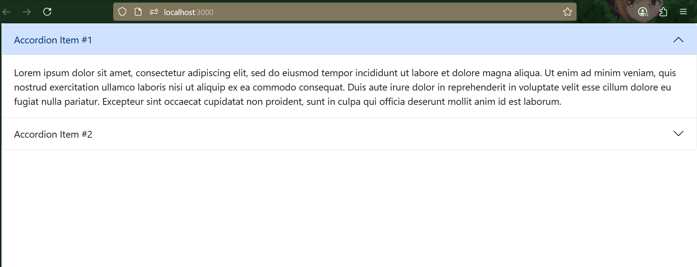
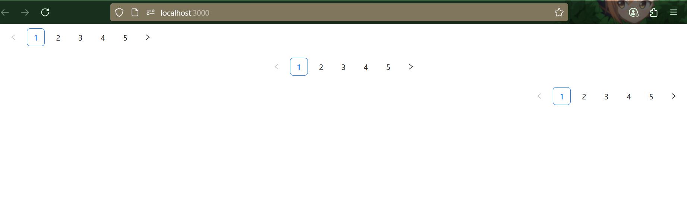

# React UI Framework Demo

This project demonstrates the use of three popular React UI libraries:

- Material UI (MUI)
- React Bootstrap
- Ant Design

---

## 📦 Install Dependencies

```bash
1.] MUI :
npm install @mui/material @emotion/react @emotion/styled

2] Bootstrap :
npm install react-bootstrap bootstrap

3] AntDesign :
npm install antd
--> Add this in index.js:
import 'bootstrap/dist/css/bootstrap.min.css';

```

## ▶️ Run Project :
```npm start```

---

## 📷 UI Outputs (Screenshots)

### 1. MUI Alert Output


### 2. Bootstrap Accordion Output


### 3. AntDesign Pagination Output



